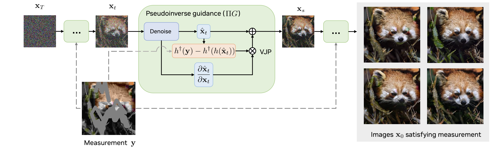
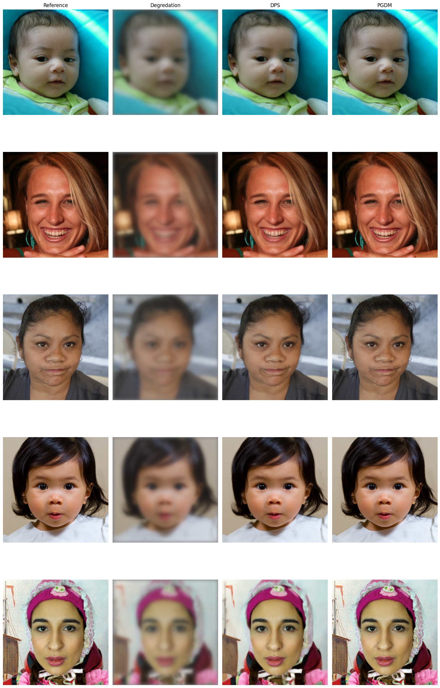
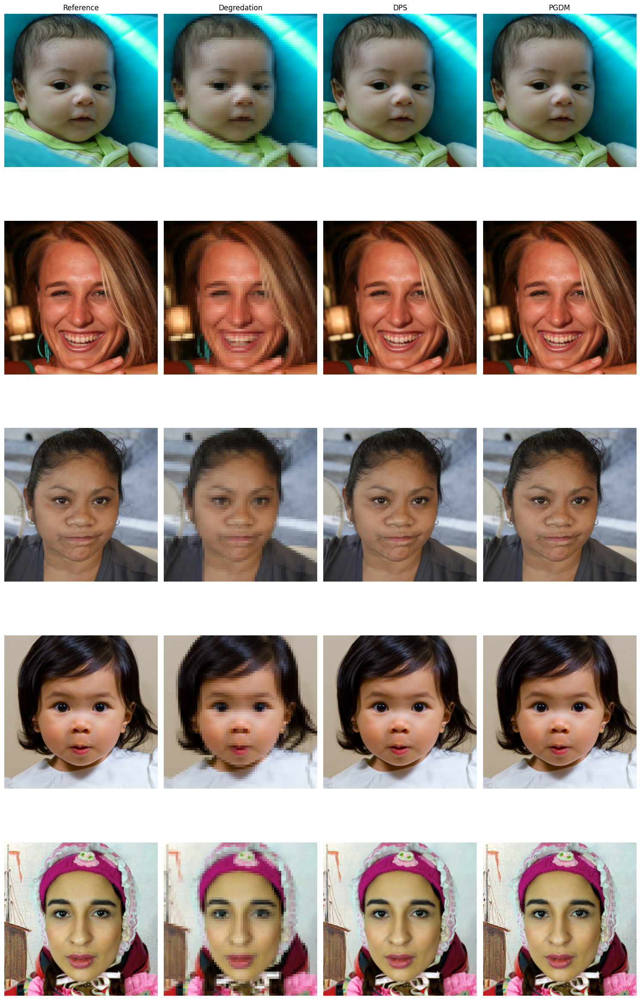

# Pseudo inverse guided diffusion 

## Description
The goal of this project is to implement the method described in https://openreview.net/forum?id=9_gsMA8MRKQ and compare it to https://arxiv.org/abs/2209.14687



## Table of Contents
- [Installation](#installation)
- [Usage](#usage)
- [Results](#results)


## Installation
To run this project, you will need to run the following commands in your terminal:

```bash 
pip install -r requirement.txt 
wget -nc -O ffhq256-1k-validation.zip 'https://www.dropbox.com/scl/fi/pppstbdsf0em6o0qscruc/ffhq256-1k-validation.zip?rlkey=xl7nwv2nxb6yvsirr3wad77hm'
unzip -nq ffhq256-1k-validation.zip
wget -nc -O ffhq_10m.pt 'https://www.dropbox.com/scl/fi/pq72vxzxcbygieq5z4gvf/ffhq_10m.pt?rlkey=5sxdj6r4o9f7b7bbp5fxg2f5r' 


```

## Usage
Then you can use the different slurms scripts to get the results on FFHQ and evaluate the results. 

```bash
sbatch /Users/newt/Desktop/MVA/MGI/PGDM_project/sample.sh
```
```bash
sbatch /Users/newt/Desktop/MVA/MGI/PGDM_project/evaluate.sh
```

## Results

| Method | SSIM ↑ | LPIPS ↓ | FID ↓ | PSNR ↑ |
| ------ | ------ | ------- | ----- | ------ |
| Π GDM  | 0.98   | **0.03** | **3.2** | 35.9  |
| DPS    | **0.79** | 0.21 | 24.1 | **22.8** |

*9x9 deblurring on FFQH val set*

| Method | SSIM ↑ | LPIPS ↓ | FID ↓ | PSNR ↑ |
| ------ | ------ | ------- | ----- | ------ |
| Π GDM  | **0.92** | 0.09 | 14.9 | **26.1** |
| DPS    | 0.93 | 0.09 | **8.5** | 27.6 |

*2x downscaling on FFQH val set*

Here are some example images generated by the method:

___

### 9x9 deblurring


___ 
### 2x downscaling


